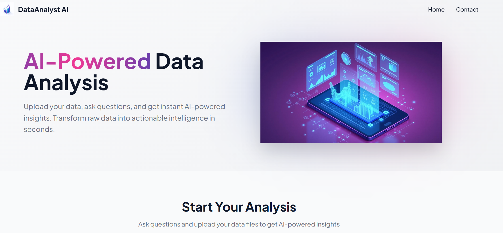

# DataAnalyst AI 🤖📊

A powerful AI-driven data analysis application that can analyze CSV, Excel, PDF files, and even images. Built with n8n backend (webhook) and Lovable frontend for seamless data insights.

## 🌟 Features

- 📈 **CSV Analysis** - Upload and analyze CSV files with AI-powered insights
- 📊 **Excel Support** - Process and analyze Excel spreadsheets
- 📄 **PDF Processing** - Extract and analyze data from PDF documents
- 🖼️ **Image Analysis** - Analyze data visualizations and charts from images
- 🤖 **AI-Powered** - Intelligent data interpretation and insights
- 🚀 **Fast & Efficient** - Quick processing with n8n backend
- 💻 **User-Friendly Interface** - Clean and intuitive UI built with Lovable

## 🎯 Try It Now!

**Live Demo:** [https://ai-data-ask.lovable.app/](https://ai-data-ask.lovable.app/)

Try DataAnalyst AI for free and experience the power of AI-driven data analysis!

## 🏗️ Architecture

- **Backend:** n8n (Webhook-based automation)
- **Frontend:** Lovable
- **Integration:** n8n + Lovable seamless connection

## 🚀 Getting Started

1. Visit the live application: [https://ai-data-ask.lovable.app/](https://ai-data-ask.lovable.app/)
2. Upload your data file (CSV, Excel, PDF, or Image)
3. Let the AI analyze your data
4. Get instant insights and visualizations

## 📸 Screenshots

## 🛠️ Tech Stack

- **Backend Automation:** n8n
- **Frontend Framework:** Lovable
- **AI Integration:** Advanced AI models for data analysis
- **File Processing:** Support for multiple file formats

## 📋 Supported File Formats

| Format | Extension | Status |
|--------|-----------|--------|
| CSV | `.csv` | ✅ Supported |
| Excel | `.xlsx`, `.xls` | ✅ Supported |
| PDF | `.pdf` | ✅ Supported |
| Images | `.png`, `.jpg`, `.jpeg` | ✅ Supported |

## 📞 Contact

For questions, feedback, or collaboration opportunities, feel free to reach out:

| Contact Type | Details |
|--------------|---------|
| **Name** | Pejman Ebrahimi |
| **Email (Primary)** | [pejman.ebrahimi77@gmail.com](mailto:pejman.ebrahimi77@gmail.com) |
| **Email (Secondary)** | [pejman.ebrahimi@uni.li](mailto:pejman.ebrahimi@uni.li) |
| **GitHub** | [@arad1367](https://github.com/arad1367) |
| **Repository** | [DataAnalyst-AI](https://github.com/arad1367/DataAnalyst-AI) |

## 🤝 Contributing

Contributions, issues, and feature requests are welcome! Feel free to check the [issues page](https://github.com/arad1367/DataAnalyst-AI/issues).

## 📝 License

This project is open source and available under the [MIT License](LICENSE).

## ⭐ Show Your Support

If you find this project helpful, please give it a ⭐️ on GitHub!

## 🔗 Links

- **Live Application:** [https://ai-data-ask.lovable.app/](https://ai-data-ask.lovable.app/)
- **GitHub Repository:** [https://github.com/arad1367/DataAnalyst-AI](https://github.com/arad1367/DataAnalyst-AI)

---

**Made with ❤️ by Pejman Ebrahimi**

*Powered by n8n + Lovable*
